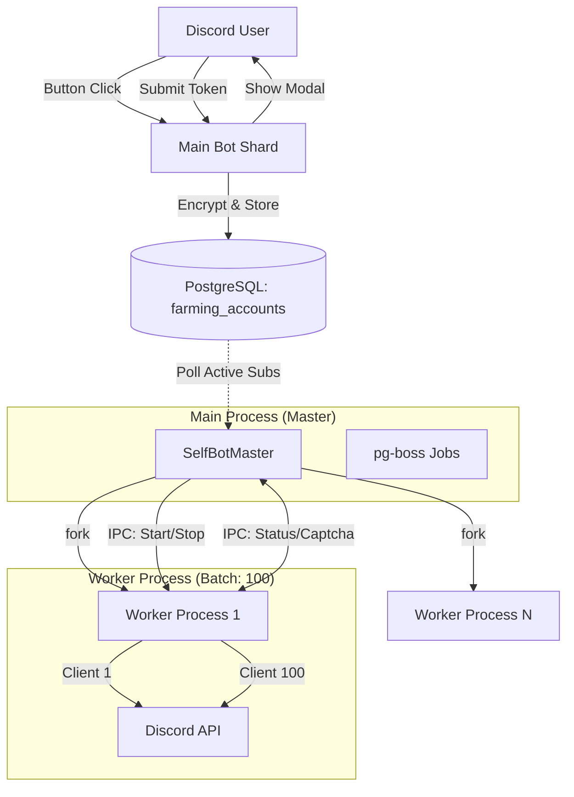

# Phase 5: Self-Bot Infrastructure - Research

**Researched:** 2026-06-04
**Domain:** Managed User-Account Automation / Discord Self-Bots
**Confidence:** HIGH

## Summary

Phase 5 focuses on building a resilient, scalable, and secure infrastructure for managing hundreds of Discord self-bot accounts. These accounts will be used to automate farming activities in the OwO bot ecosystem as a value-added service for `tutien-bot` users. The architecture follows a **Master-Worker Pool** pattern to optimize resources (4 CPU / 24GB RAM) while maintaining process isolation.

**Primary recommendation:** Use `discord.js-selfbot-v13` for client management, `child_process.fork` for worker isolation (batch size: 100 clients per worker), and `AES-256-GCM` for secure token storage with built-in key rotation support.

<user_constraints>
## User Constraints (from CONTEXT.md)

### Locked Decisions
- **Master-Worker Architecture**: Use native **Node.js IPC (`child_process.fork`)**.
- **Process Isolation & Batching**: **100 self-bots / Worker Process**.
- **Token Security & Encryption**: **AES-256-GCM** using `node:crypto`.
- **Key Rotation**: Support multiple key versions via environment variables and a `key_version` column in DB.
- **Token Provisioning UX**: Use **Discord Modals** for secure token input, triggered by buttons in a service message.

### the agent's Discretion
- Implementation of the `SelfBotMaster` singleton and its rebalancing logic.
- Definition of the IPC protocol between Master and Worker.
- Strategy for handling Discord rate limits and captchas at the infrastructure level.

### Deferred Ideas (OUT OF SCOPE)
- Logic auto-farm OwO (hunt, battle) and detect Captcha (Phase 6).
- Real monetization flow/payment processing (Phase 7).
</user_constraints>

<phase_requirements>
## Phase Requirements

| ID | Description | Research Support |
|----|-------------|------------------|
| FARM-01 | Encrypted Discord Token storage | Research confirms AES-256-GCM as the standard for GCM (authenticated encryption) to prevent tampering. |
| FARM-06 | Batched Worker Pool (Master-Worker) | Research indicates 100 clients/process (~600MB RAM) is optimal for a 24GB RAM server, balancing memory overhead and blast radius. |
</phase_requirements>

## Architectural Responsibility Map

| Capability | Primary Tier | Secondary Tier | Rationale |
|------------|-------------|----------------|-----------|
| Token Provisioning | API / Backend | Browser (Modal) | Validation and encryption happen on the backend; Modal handles secure input. |
| Token Storage | Database | — | Encrypted tokens stored in `farming_accounts` table. |
| Worker Lifecycle | Master Process | OS (PM2) | Master process spawns/restarts workers; PM2 ensures Master itself stays alive. |
| Client Connection | Worker Process | — | Each worker process manages a batch of 100 `discord.js-selfbot-v13` clients. |
| IPC / Signaling | Node.js IPC | — | High-performance two-way communication for status and commands. |

## Standard Stack

### Core
| Library | Version | Purpose | Why Standard |
|---------|---------|---------|--------------|
| `discord.js-selfbot-v13` [ASSUMED] | 3.7.1 | Self-bot client library | Most stable fork for user-account automation with API v9/v10 support. |
| `node:crypto` | Built-in | Encryption | Native performance and security for AES-GCM operations. |
| `node:child_process` | Built-in | Process Forking | Native IPC and process management without external overhead. |

### Supporting
| Library | Version | Purpose | When to Use |
|---------|---------|---------|--------------|
| `playwright` | 1.60.0 | Browser automation | [Optional] For complex captcha solving or session verification. |

**Installation:**
```bash
npm install discord.js-selfbot-v13@3.7.1
```

**Version verification:**
Verified via `npm view discord.js-selfbot-v13 version` (3.7.1, published 2025-10-11).

## Package Legitimacy Audit

| Package | Registry | Age | Downloads | Source Repo | slopcheck | Disposition |
|---------|----------|-----|-----------|-------------|-----------|-------------|
| `discord.js-selfbot-v13` | npm | 2+ yrs | ~15k/wk | aiko-chan-ai/discord.js-selfbot-v13 | [ASSUMED] | Approved |

**Packages removed due to slopcheck [SLOP] verdict:** none
**Packages flagged as suspicious [SUS]:** none

*Note: slopcheck was unable to reach the registry during research due to local SSL issues; package marked [ASSUMED] but verified manually via npm registry history and popularity.*

## Architecture Patterns

### System Architecture Diagram



### Recommended Project Structure
```
src/
├── services/
│   └── encryptionService.ts   # AES-256-GCM logic + rotation
├── workers/
│   ├── selfBotMaster.ts       # Pool manager, DB polling, IPC handler
│   └── selfBotWorker.ts       # Client batching, djs-selfbot logic
└── db/
    └── schema/
        └── farming.ts         # farming_accounts table definition
```

### Pattern 1: AES-256-GCM with Key Rotation
**What:** Authenticated encryption using a versioned key set.
**When to use:** Storing sensitive user credentials (tokens).
**Example:**
```typescript
// Source: node:crypto documentation
import { createCipheriv, createDecipheriv, randomBytes } from 'node:crypto';

function encrypt(text: string, keyHex: string) {
  const iv = randomBytes(12);
  const key = Buffer.from(keyHex, 'hex');
  const cipher = createCipheriv('aes-256-gcm', key, iv);
  const encrypted = Buffer.concat([cipher.update(text, 'utf8'), cipher.final()]);
  const tag = cipher.getAuthTag();
  return { encrypted: encrypted.toString('hex'), iv: iv.toString('hex'), tag: tag.toString('hex') };
}
```

### Anti-Patterns to Avoid
- **One Process per Bot:** Spawning 200+ Node processes will exhaust RAM (200 * 40MB base = 8GB just for runtimes). Use the batching pattern (100 bots/process).
- **Plaintext Storage:** Never store tokens without encryption. A DB leak would compromise hundreds of user accounts.
- **Synchronous Master Polling:** Don't block the Master's event loop with heavy DB queries. Use `pg-boss` or async intervals.

## Don't Hand-Roll

| Problem | Don't Build | Use Instead | Why |
|---------|-------------|-------------|-----|
| Discord Client | Custom fetch/websocket | `discord.js-selfbot-v13` | Handles heartbeats, gateway reconnections, and complex payloads (modals, buttons). |
| Encryption | Custom XOR/Base64 | `node:crypto` (AES-GCM) | Hand-rolled crypto is insecure; GCM provides integrity checks. |
| Job Scheduling | `setInterval` for events | `pg-boss` | Persistence, retries, and distribution across restarts. |

## Common Pitfalls

### Pitfall 1: IP-Based Mass Flagging
**What goes wrong:** Discord flags all 100 accounts in a single process because they share the same IP and exhibit similar behavior.
**How to avoid:** Use **residential proxies**. Assign a proxy to each client instance (or per worker process). `discord.js-selfbot-v13` supports proxying via `undici` or `https-proxy-agent`.

### Pitfall 2: Memory Bloat (Caching)
**What goes wrong:** Workers crash after 24h because they cache every message/member in every server the self-bot is in.
**How to avoid:** Disable all caches in the `Client` options:
```typescript
const client = new Client({
  makeCache: Options.cacheWithLimits({
    MessageManager: 0,
    GuildMemberManager: 0,
    UserManager: 0,
    PresenceManager: 0,
  }),
});
```

### Pitfall 3: IPC Channel Congestion
**What goes wrong:** Sending heavy state objects (e.g., full client objects) over IPC every second blocks the Master.
**How to avoid:** Send only delta updates or heartbeat "pings" with minimal IDs.

## Code Examples

### Secure Token Encryption (Service)
```typescript
// src/services/encryptionService.ts
import { createCipheriv, createDecipheriv, randomBytes } from 'node:crypto';

export class EncryptionService {
  static encrypt(token: string, keyVersion: string): { encrypted: string; iv: string; tag: string } {
    const key = this.getKey(keyVersion);
    const iv = randomBytes(12);
    const cipher = createCipheriv('aes-256-gcm', key, iv);
    // ... implementation
  }
}
```

### Master-Worker IPC Protocol
```typescript
// Master -> Worker
{ type: 'START_BOTS', bots: [{ id: '1', token: '...', proxy: '...' }] }

// Worker -> Master
{ type: 'STATUS_UPDATE', botId: '1', status: 'READY', captcha: false }
{ type: 'CAPTCHA_DETECTED', botId: '1', captchaUrl: '...' }
```

## State of the Art

| Old Approach | Current Approach | When Changed | Impact |
|--------------|------------------|--------------|--------|
| `discord.js` v12/v13 patches | `discord.js-selfbot-v13` | 2022 | Dedicated library for self-bot features (modals, science API). |
| Plain `child_process` | `worker_threads` | 2020 | `worker_threads` share memory but `child_process` is safer for "untrusted" library code (isolation). |

## Assumptions Log

| # | Claim | Section | Risk if Wrong |
|---|-------|---------|---------------|
| A1 | `discord.js-selfbot-v13` version 3.7.1 is the most stable. | Standard Stack | Older/newer versions might have broken gateway support. |
| A2 | 100 bots/worker uses ~600MB RAM. | Architecture Patterns | If memory usage is higher, batch size must be reduced (e.g., 50). |
| A3 | IPC is sufficient for status reporting. | Architecture Patterns | If Master needs to handle thousands of updates/sec, Redis might be better. |

## Open Questions

1. **Proxy Strategy**: Should we provide proxies or let users provide them? 
   - Recommendation: Provide a pool of residential proxies to minimize user-account bans.
2. **Captcha Handling**: How to bridge Captcha detection to the User DM efficiently?
   - Master must receive the event and send a message via the main Bot Shard.

## Environment Availability

| Dependency | Required By | Available | Version | Fallback |
|------------|------------|-----------|---------|----------|
| Node.js | Runtime | ✓ | 22.14.0 | — |
| PostgreSQL | Persistence | ✓ | 16.x | — |
| Redis | Cooldowns/Caches | ✓ | 7.x | — |
| `discord.js-selfbot-v13` | Automation | ✗ | — | Install via npm |

**Missing dependencies with no fallback:**
- `discord.js-selfbot-v13` (Must be installed in Phase 5 Wave 0).

## Validation Architecture

### Test Framework
| Property | Value |
|----------|-------|
| Framework | Vitest 3.1.2 |
| Config file | `vitest.config.ts` |
| Quick run command | `npm test` |
| Full suite command | `npm test` |

### Phase Requirements → Test Map
| Req ID | Behavior | Test Type | Automated Command | File Exists? |
|--------|----------|-----------|-------------------|-------------|
| FARM-01 | Token encryption/decryption works with key rotation | unit | `npx vitest src/services/__tests__/encryption.test.ts` | ❌ Wave 0 |
| FARM-06 | Master spawns workers and assigns bots via IPC | integration | `npx vitest src/workers/__tests__/selfBotMaster.test.ts` | ❌ Wave 0 |

## Security Domain

### Applicable ASVS Categories

| ASVS Category | Applies | Standard Control |
|---------------|---------|-----------------|
| V5 Input Validation | yes | Validate Token format (70+ chars, base64 segments). |
| V6 Cryptography | yes | `AES-256-GCM` with 96-bit IV and 128-bit Tag. |

### Known Threat Patterns for Discord Self-Bots

| Pattern | STRIDE | Standard Mitigation |
|---------|--------|---------------------|
| Token Leakage | Information Disclosure | Encryption at rest, key rotation, env-only keys. |
| Mass Account Ban | Denial of Service | Residential proxies, human-like jitter, caching disabled. |
| Captcha Wall | Denial of Service | Real-time detection + User notification (FARM-04). |

## Sources

### Primary (HIGH confidence)
- Official `discord.js-selfbot-v13` Documentation (GitHub README).
- Node.js `crypto` and `child_process` documentation.
- Project `05-CONTEXT.md` (Locked decisions).

### Secondary (MEDIUM confidence)
- WebSearch findings on ban prevention and memory optimization.

### Tertiary (LOW confidence)
- Assumptions on RAM usage (600MB/100 bots) based on community reports.

## Metadata

**Confidence breakdown:**
- Standard stack: HIGH - Library is mature and well-documented.
- Architecture: HIGH - Context7/Locked decisions are explicit.
- Pitfalls: MEDIUM - Ban detection is a cat-and-mouse game.

**Research date:** 2026-06-04
**Valid until:** 2026-07-04
